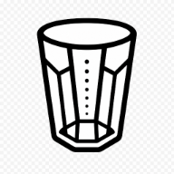
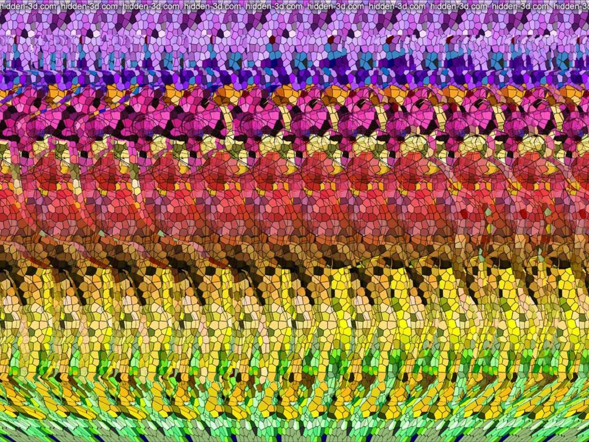
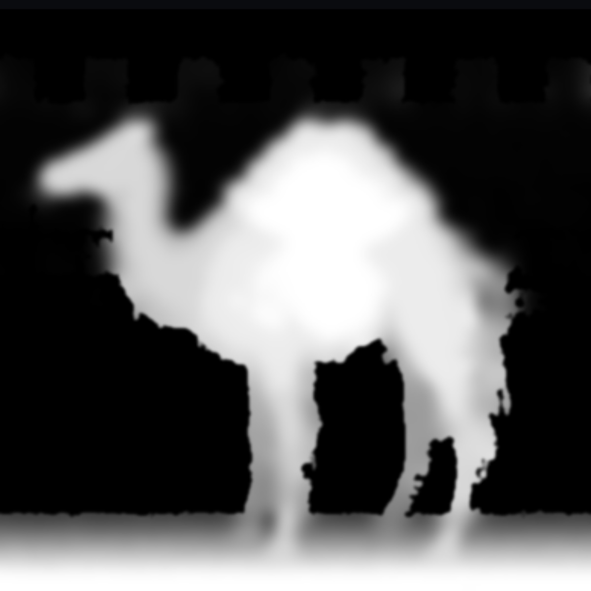

# Stogram: Stereogram Viewer

<p align="center"></p>

An [autostereogram](https://en.wikipedia.org/wiki/Autostereogram) and depth map viewer: reconstructs a depth map, builds a 3D surface or layers, and allows the texture to be changed independently.

<div align="center" style="display: flex; align-items: center; gap: 10px;">
  
  <span>→</span>
  
  <span>→</span>
  <video src="src/demo/example.mp4" controls style="max-height: 512px; max-width: 31%;">
    <a href="src/demo/example.mp4">View the 3D result</a>
  </video>
</div>

## Features

- Depth map reconstruction from a color autostereogram.
- Loading grayscale images as ready-made depth maps.
- Surface, layer, and 2D depth map modes.
- Convex and concave geometry.
- Independent texture replacement without losing the original stereogram and depth.

## Loading Images

A color image is treated as a stereogram and also becomes the texture.

A grayscale image is treated as a ready-made depth map.

A depth map replaces the geometry while preserving the current texture. If there is no texture yet, the map itself is used.

## Interface

| Control | Action |
| --- | --- |
| `＋` | Load a stereogram or depth map |
| `▧` | Replace the texture |
| `↻` | Recalculate the depth map |
| `⊕` | Reset the camera |
| `▶` | Auto-rotation |
| `◠` / `◡` | Convex / concave geometry |
| `❍` | 3D surface |
| `≡` | Layers |
| `◩` | 2D depth map |

| Slider | Action |
| --- | --- |
| `↕︎` | Depth scale |
| `≡` | Number of layers |
| `↔` | Stereogram period |

## Controls

- Drag — rotation.
- Mouse wheel or pinch — zoom.
- Double-click — reset the camera.
- Regular drop — load a geometry source.
- Drop onto `▧` or `Shift + drop` — replace the texture.

## Depth Map Calculation

```text
Stereogram
    ↓ resize to 512 px + grayscale
Global period search
    ↓ refinement using local blocks
5×5 Census
    ↓ cost volume for possible disparities
Four-direction SGM
    ↓ best disparity selection + confidence
3 local ICM refinement passes
    ↓ normalization and background detection
Island and MAD spike removal
    ↓ hole filling and contour smoothing
Weighted median
    ↓ mask-aware Gaussian smoothing
Soft contour coverage (antialiasing)
    ↓ robust 1–99% depth normalization
    ↓
Ready depth map
    ↓
3D mesh or discrete layers
```
