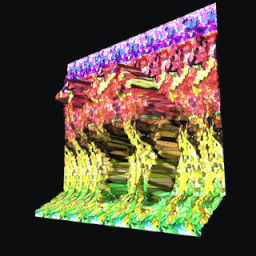

<h1> <a href="https://mrfeod.github.io/stogram/">Stogram: Stereogram Viewer</a></h1>

An interactive [autostereogram](https://en.wikipedia.org/wiki/Autostereogram) and depth map viewer. It reconstructs depth and renders it in Eye View, as discrete layers, or as a shaded 3D surface. Geometry and texture can be replaced independently.

<p align="center">
  Autostereogram<br>
  <br>
  ↓<br>Depth map<br>
  <br>
  ↓<br>
  3D Surface or Human-eye-like view<br>
  
  <br>
</p>

## Features

- Depth map reconstruction from a color autostereogram.
- Loading grayscale images as ready-made depth maps.
- Eye View, layer, 3D surface, and 2D depth map modes.
- Convex and concave geometry.
- Independent texture replacement without losing the original stereogram and depth.
- WebGPU-accelerated reconstruction and filtering with a CPU fallback.
- Export of the depth map as PNG and the closed surface mesh as binary STL.

## Loading Images

A color image is treated as a stereogram and also becomes the texture.

A grayscale image is treated as a ready-made depth map.

A depth map replaces the geometry while preserving the current texture. If there is no texture yet, the map itself is used.

## Interface

| Control | Action |
| --- | --- |
| `＋` | Load a stereogram or depth map |
| `▧` | Replace the texture |
| `↻` | Recalculate the depth map |
| `⊕` | Reset the camera |
| `▶` | Auto-rotation |
| `◉` | Eye View |
| `≡` | Layers |
| `❍` | 3D surface |
| `◩` | 2D depth map |
| `◠` / `◡` | Convex / concave geometry |
| `⛶` | Fullscreen |

| Slider | Action |
| --- | --- |
| `↕︎` | Depth scale |
| `↔` | Stereogram period |

## Controls

- Drag — rotation.
- Mouse wheel or pinch — zoom.
- Double-click — reset the camera.
- Tap the texture preview — fullscreen stereogram viewing.
- Regular drop — load a geometry source.
- Drop onto `▧` or `Shift + drop` — replace the texture.

## Depth Map Calculation

```text
Stereogram
    ↓ resize to a maximum of 512 px + grayscale
Global period search
    ↓ refinement using local blocks
5×5 Census
    ↓ cost volume for possible disparities
Four-direction SGM (WebGPU when available)
    ↓ best disparity selection + confidence
3 local ICM refinement passes
    ↓ normalization and background detection
Island and MAD spike removal
    ↓ hole filling and contour smoothing
Weighted median
    ↓ mask-aware Gaussian smoothing
Soft contour coverage (antialiasing)
    ↓ robust 1–99% depth normalization
Ready depth map
    ↓
Eye View, discrete layers, smoothed closed 3D mesh, PNG or STL
```
